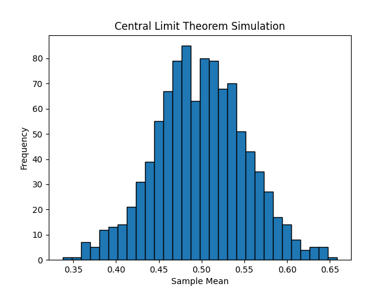

## 중심 극한 정리 (central limit theorem)
> 동일한 확률 분포를 가진 독립 확률 변수 n개의 평균의 분포는 n이 적당히 크다면 정규 분포에 가까워진다.

1. 표본 평균의 평균은 모집단 평균과 같다.
2. 모집단이 정규 분포면 표본 평균도 정규 분포가 된다.
3. 모집단이 정규 분포가 아니지만 표본 크기가 30보다 큰 경우 표본 평균은 대략적으로 정규 분포를 따른다.
4. 표본 평균의 표준 편차는 모집단 표준 편차를 n의 제곱근으로 나눈 값과 같다.
$$
\sigma_{\overline x} = \frac{\sigma}{\sqrt n}
$$

```python
import random
import matplotlib.pyplot as plt

sample_size = 31
sample_count = 1000

x_values = [(sum([random.uniform(0.0, 1.0) for i in range(sample_size)]) / sample_size) for _ in range(sample_count)]

# 히스토그램 그리기
plt.hist(x_values, bins=30, edgecolor='black')
plt.title('Central Limit Theorem Simulation')
plt.xlabel('Sample Mean')
plt.ylabel('Frequency')
plt.show()
```


표본 크기를 1 또는 2로 작게 시도할 경우 정규 분포가 나타나지 않는다.

중심 극한 정리를 만족하고 정규 분포를 만들기 위해 필요한 교과서적인 표본 크기는 31이지만,
기본 분포가 멀티모달이거나 비대칭인 경우 더 큰 표본이 필요하다. -> 다다익선

## 신뢰 구간 (confidence interval)